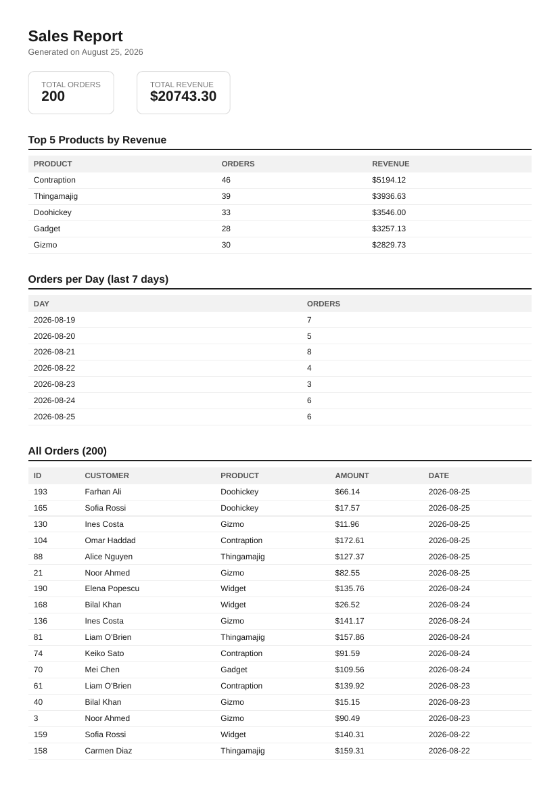

# PDF report generator

**FlyRank Internship · Backend Track · W4 · A8**

A small API that turns a SQLite database of sales orders into a real PDF report:
query the data with SQL → render it into HTML → print it to a PDF with a headless
browser → store it on disk → hand it out by link. No background jobs — the whole
pipeline runs inside one plain endpoint.

## Dataset

**Option A — the little shop.** A SQLite table `orders(id, customer, product, amount,
created_at)` filled with ~200 seeded random orders across 6 products and the last 30 days.

## How to run it

Requires Python 3.10+.

```bash
# 1. install dependencies
pip install -r requirements.txt
playwright install chromium

# 2. seed the database (safe to run more than once — it deletes before inserting)
python3 seed.py

# 3. start the API
python3 -m uvicorn app:app --reload
# -> http://localhost:8000
```

Then, in another terminal:

```bash
# health check
curl -i http://localhost:8000/health

# generate a report (takes a few seconds — the pipeline runs inline)
curl -i -X POST http://localhost:8000/reports -H "Content-Type: application/json" -d '{}'

# download it
curl -o my-report.pdf http://localhost:8000/reports/1/file
```

## Endpoints

| Method | Path                   | Does                                                              |
|--------|------------------------|--------------------------------------------------------------------|
| GET    | `/health`              | `{ "status": "ok" }`                                               |
| POST   | `/reports`             | Runs query → render → store, returns `201` + `{id, file}` (or `200` + the existing report if one was already made today — see Idempotency below). Body: `{"force": true}` to skip the once-a-day check. |
| GET    | `/reports/{id}`        | The report row + file link, or `404`                               |
| GET    | `/reports/{id}/file`   | Serves the PDF bytes from disk                                     |

## The aggregation SQL (Stage 2)

Four queries feed the report — pasted from `report.py`:

```sql
-- total orders
SELECT COUNT(*) AS n FROM orders;

-- total revenue
SELECT COALESCE(SUM(amount), 0) AS total FROM orders;

-- top 5 products by revenue
SELECT product, SUM(amount) AS revenue, COUNT(*) AS order_count
FROM orders
GROUP BY product
ORDER BY revenue DESC
LIMIT 5;

-- orders per day, last 7 days
SELECT created_at AS day, COUNT(*) AS order_count
FROM orders
WHERE created_at >= date('now', '-6 days')
GROUP BY created_at
ORDER BY created_at ASC;
```

## Download proof

```
$ curl -i -X POST http://localhost:8000/reports -H "Content-Type: application/json" -d '{}'
HTTP/1.1 201 Created
content-type: application/json

{"id":1,"file":"/reports/1/file"}

$ curl -o my-report.pdf http://localhost:8000/reports/1/file
$ file my-report.pdf
my-report.pdf: PDF document, version 1.4, 6 page(s)
```

### Page 1 of a generated report



## Stage 4 sentence — when would this leave the request?

Right now `POST /reports` blocks for about a second while Chromium renders the PDF —
fine for one user clicking one button. I'd move generation into a background job (the
A7 pattern: return `202` + an id immediately, then poll or webhook for `done`) once
either the report gets big enough that rendering takes several seconds, or enough
users hit the endpoint concurrently that a few slow requests start tying up worker
processes other users need.

## Stage 5 — idempotency

**What the check protects against:** a user double-clicking "Generate report" (or a
flaky client retrying a POST that actually succeeded) turning one intended report into
two, three, or more identical PDFs piling up on disk and in the `reports` table.

**Real-world example:** an e-commerce checkout button. If "Place order" isn't
idempotent, a slow network + an impatient double-click can charge a customer's card
twice for one order — the exact same failure mode as the workshop's "never email a
customer twice," just with money attached instead of an inbox.

**Proof — two rapid POSTs, same id, one new file:**

```
$ curl -X POST http://localhost:8000/reports -d '{}'
{"id":1,"file":"/reports/1/file"}
$ curl -X POST http://localhost:8000/reports -d '{}'
{"id":1,"file":"/reports/1/file"}
$ ls reports/
1.pdf

$ curl -X POST http://localhost:8000/reports -d '{"force": true}'
{"id":2,"file":"/reports/2/file"}
$ ls reports/
1.pdf  2.pdf
```

## Project layout

```
db.py       # SQLite connection + schema (orders, reports)
seed.py     # Stage 1: fills orders with ~200 random rows, safe to run twice
report.py   # Stage 2 (SQL aggregation) + Stage 3 (HTML -> PDF via Playwright)
app.py      # Stage 0, 4, 5: FastAPI endpoints, storage, once-per-day idempotency
```

## Requirements checklist

- [x] `report.db` exists and `seed.py` fills it with ~200 orders, even run twice
- [x] Aggregation queries (two totals, a top 5, a grouped breakdown) — pasted above
- [x] PDF renders from real data, ≥2 pages, no row cut by a page break (header repeats via `<thead>`)
- [x] `POST /reports` → `201` + id + file link; `GET /reports/:id` → record; unknown id → `404`
- [x] File stored on disk, served by link — JSON responses never carry file bytes
- [x] Duplicate requests → one file (two rapid POSTs, same id, one new PDF)
- [x] `.gitignore` excludes `reports/` and `report.db`
